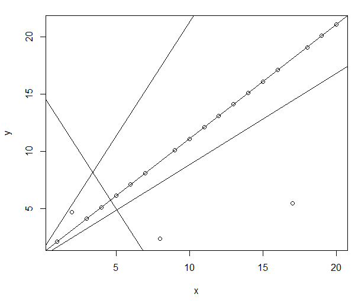

## 一、经典线性回归模型的回顾

1889 年, Galton 在研究祖先与后代之间的关系时发现，身材较高的父母, 他们的孩子也较高, 但这些孩子的平均身高并没有他们父母的平均身高高; 身材较矮的父母, 他们的 孩子也较矮, 但这些孩子的平均身高却比他们的父母平均身高要高。Galton 把这种后代的 身高向中间值靠近的趋势称为 “回归 (Regression)”, 回归一词就此诞生。

在线性模型中, 我们假定因变量 $y$ 和自变量 $x$ 之间的关系可以用线性关系来近似。手 们用误差项独立同分布, 其均值为 0 , 方差为 $\sigma^{2}$ 的基本假定来保证不同的 $y_{i}$ 不相关, 确保 $E(Y)=X \beta$, 以及 ${Var}(Y)=\sigma^{2} I$ 。这个前提保证了线性模型的正确性。
在手工计算以及回归分析的起步阶段，这种假定的合理性与便利性是容易理解的。以 两个变量为例, 一次函数既能够反映两个变量相关性的正、负（表现在表达式中的斜率上), 也较容易通过手工计算出结果。当我们将自变量 $X$ 与因变量 $y$ 的取值绘制在直角坐 标系中, 我们可以手工绘制出许多条直线, 来描述两个变量之由的关系。但是哪一条直线 能够最好地描述目变量 $X$ 与因变量 $y$ 之间的天系呢? 一个基本想法是, 我们设定一个指与因变量 $y$ 之间的差距, 差距越小, 评估结果越好, 越是我们应该选择的估计结果。

在这里, 这个指标就是回归中的残差 (residual)。每一次观测值对应一个残差值, 模 型整体的指标就是把这些残差值“累计起来”。由于残差值有正有负, 我们习惯选择残差值 的平方和来实现把它们累积起来。最小的残差如何找到？在经典回归模型中, 由于二次函数形式简单以及连续可导, 我们通常选择最小二乘估计法，来估计出 $\beta$ 的值。
对于多元的回归分析模型:
$$
y=X \beta+\varepsilon
$$
利用最小二乘法， 对 $\beta$ 求偏导, 找到函数取到极小值 时，对应的 $\beta$ 表达形式。
$$
\frac{\partial\left(y^{T} y-2 y^{T} X \beta+\beta^{T} X^{T} X \beta\right)}{\partial \beta}=0 \Rightarrow \hat{\beta}=\left(X^{T} X\right)^{-1} X^{T} y
$$
对 $\hat{\beta}$ 表达式两端取期望, 我们得到:
$$
E(\hat{\beta})=\beta, \operatorname{Var}(\hat{\beta})=\sigma^{2}\left(X^{T} X\right)^{-1}
$$
根据 $\varepsilon$ 的基本假设, 我们得到, $\hat{\beta}$ 服从分布 $N\left(\beta, \sigma^{2}\left(X^{T} X\right)^{-1}\right)$; 而当 $\varepsilon$ 不满足正态性的基本假设时, 如果样本量足够大, 由中心极限定理, $\hat{\beta}$ 近似服从分布
$N\left(\beta, \sigma^{2}\left(X^{T} X\right)^{-1}\right)$.
下面, 我们来讨论 $\sigma^{2}$ 的估计方法。这里采取极大似然估计法, 先写出 $\sigma^{2}$ 的似然函数 值:
$$
\ln L\left(\sigma^{2}\right)=-\frac{n}{2} \ln \left(2 \pi \sigma^{2}\right)-\frac{1}{2} \frac{(y-X \hat{\beta})^{T}(y-X \hat{\beta})}{\sigma^{2}}
$$
再对其进行求导, 得出一个估计值。
$$
\hat{\sigma}^{2}=\frac{(y-X \hat{\beta})^{T}(y-X \hat{\beta})}{n}
$$
这个估计值是有偏的, 为了使其无偏, 我们把 $n$ 换成 $n-(p+1)$. 得到其无偏估计。

## **二、**   **经典线性回归模型的风险**

一是误差项独立同正态分布的基本假定无法证实。在实际的社科应用中，残差往往不能够完全满足误差项独立同正态分布的性质。在多少样本情况下才能保证中心极限定理成立，也没有确定的划分标准。

二是最小二乘估计的假定了损失的对称形式。在实际生活中，如制造业对于偏离标准大小的损失的“敏感程度”并不相同，这种估计方法可能会造成不合理的估计值。

三是模型评价的标准不唯一。我们知道，在多元线性回归中，我们关心R方，关心F检验的P值，关心各个自变量的P值，关心“AIC”、“BIC”、“SBC”哪个模型比较小。实际的分析中，往往很多模型“都一样好（差）”，自变量与因变量到底是什么关系，还是无法说清。

## **三、**   **关于评价标准的讨论**

什么是一个“好模型”？一个好的模型应当能够较好的反映自变量与因变量的“真实关系”。当给出一个自变量时，估计出的因变量值应该接近实际的因变量。“预测”是一种较好的评估模型优劣的方法。

交叉验证法是一种关于寻找最高预测精度的模型。在这种方法中，我们把数据随机分成n份，轮流每次用1份做测试集，其余n-1份做训练集，然后用测试集做预测，得到标准化均方误差（NMSE）。哪个的标准化均方误差最小，哪个就是相对最好的模型。

## **四、**   交叉验证：一个实例

嘌呤霉素（Puromycin，datasets包）数据是关于处理过以及未处理过的细胞在不同物质浓度下的酶反应速度的。一共有23个观测值与3个变量，这些变量包括rate（酶反应速率），conc（物质浓度）以及state（0-1变量，处理过以及未处理过）。现在我们以rate作为因变量，conc作为自变量，建立模型，试图描述两者之间的关系。

​    从散点图可以看出，经过处理的组别明显酶反应速率更高，随着物质浓度增高，酶反应速率增强。根据此基础，建立如下6个模型。

| **模型** | **形式**                                                     |
| -------- | ------------------------------------------------------------ |
| **1**    | $y=\beta_{0}+\beta_{1} x+\varepsilon $                       |
| **2**    | $y=\beta_{0}+\beta_{1} x+\alpha_{i}+\varepsilon$             |
| **3**    | $y=\beta_{0}+\left(\beta_{1}+\gamma_{i}\right) x+\alpha_{i}+\varepsilon$ |
| **4**    | $y=\beta_{0}+\beta_{1} \ln (x)+\varepsilon$                  |
| **5**    | $y=\beta_{0}+\beta_{1} \ln (x)+\alpha_{i}+\varepsilon$       |
| **6**    | $y=\beta_{0}+\left(\beta_{1}+\gamma_{i}\right) \ln (x)+\alpha_{i}+\varepsilon$ |

 使用R分别计算模型结果，得到各个模型以及对应统计量的P值。6个模型每个模型的F检验的P值均小于0.05，并且其各个统计量的P值也都小于0.05，对于残差的检验均无法拒绝正态性检验。通过R方以及P值的比较，可以发现第6个模型的结果稍微好一点。

| 模型 | F检验      | ANOVA的各个统计量p值 | R方        | Shapiro检验 |                 |      |       |       |
| ---- | ---------- | -------------------- | ---------- | ----------- | --------------- | ---- | ----- | ----- |
| p值  | conc       | log(conc)            | State      | conc:state  | log(conc):state | p值  |       |       |
| 1    | 3.53×10-6  | 3.53×10-6            |            |             |                 |      | 0.649 | 0.522 |
| 2    | 3.67×10-6  | 1.49×10-6            |            | 0.045       |                 |      | 0.714 | 0.288 |
| 3    | 1.74×10-5  | 2.39×10-6            |            | 0.049       | 0.527           |      | 0.72  | 0.252 |
| 4    | 6.04×10-11 |                      | 6.04×10-11 |             |                 |      | 0.875 | 0.735 |
| 5    | 1.47×10-13 |                      | 5.68×10-14 | 3.53×10-5   |                 |      | 0.948 | 0.595 |
| 6    | 2.27×10-14 |                      | 2.96×10-15 | 2.70×10-6   |                 | 0.03 | 0.968 | 0.38  |

  第6个模型的相关参数见下表。

​    我们对这个例子做1000次5折交叉验证，得到下表结果。

| **模型** | **NMSE**    |
| -------- | ----------- |
| **1**    | 0.7199885   |
| **2**    | `0.6706496` |
| **3**    | `0.9713905` |
| **4**    | `0.3435191` |
| **5**    | `0.1552742` |
| **6**    | `0.1279869` |

 第6个模型的NMSE最小，跟上面选择的结果也是一致的。

------

[[1\]](#_ftnref1) 引自《应用回归及分类》，吴喜之，2016年，中国人民大学出版社，P33
